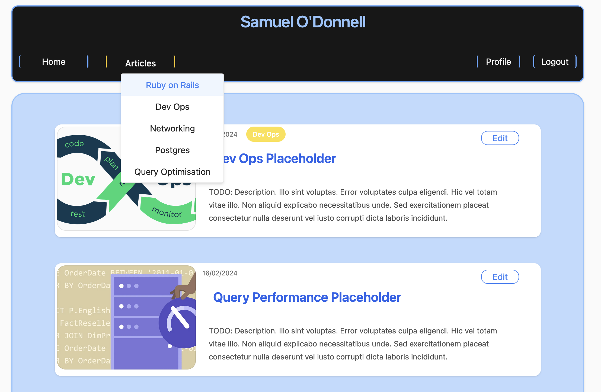
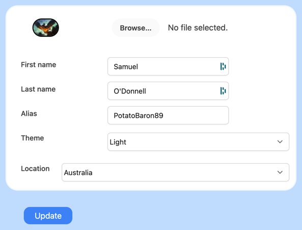
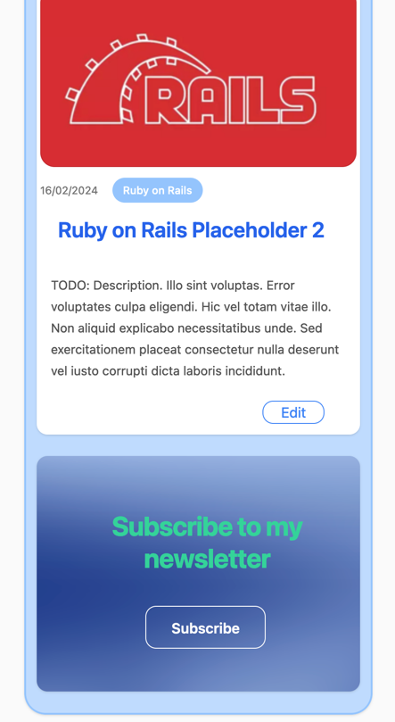

# README

Source code for my professional blog, built using Ruby on Rails.  , and is being built to showcase my skills as a developer.

### Licence: MIT

Feel free to use this code as you see fit.

### Stack

- Ruby on Rails
- PostgreSQL
- Esbuild
- Stimulus + Turbo

### Features

- Permissions: I've deliberately opted for a fairly lightweight permissions system given the requirements of this app.  Built using [cancancan](https://github.com/CanCanCommunity/cancancan). To customise, see `app/models/ability.rb`.
- Authentication: Built using [devise](https://github.com/heartcombo/devise). Currently uses out of the box config. I may look at expanding upon this in the future.
- ViewComponents: Uses [ViewComponents](https://github.com/ViewComponent/view_component) to create reusable components.  Extended so that the it expects to find a partial in `app/views/**` instead of `app/components/**`.
- NewsLetter: Not fully implemented, but the backend is there.  I'll look at expanding upon this in the future.

#### UI Features

- Built using TurboFrames to create a seamless user experience (very few full page refreshes are required).  Given time I'll like to expand upon this to create a more dynamic experience (e.g. more use of Stimulus).
- Dark Mode: Includes a dark mode, along with the ability to customise the colour scheme using the profile page.  You can select either `system`, `light` or `dark` mode.
- Create Articles: Users can create articles, and upload images.  Images are stored using [ActiveStorage](https://guides.rubyonrails.org/active_storage_overview.html).
- Comments: Users can comment on articles.
- Notifications: Users are notified when someone comments on their article.
- Avatar: Users can upload an avatar.  This is stored using ActiveStorage.
- Responsive: The site is responsive, and works well on mobile devices. Note: I plan on doing a pass to improve the styling across the site.

### Preview

### Future Work

- Improve the styling across the site. It looks okay but it could be better.
- Cleanup the codebase.  There are a few areas that could be refactored. The current state definitely isn't 'polished'.
- Add testing. Should have done this from the start.
- Finish the newsletter feature.
- Publish the site using AWS. I'll probably use Kamal and AWS since I don't really care about load balancing my dev blog. Replace the images here with a link to the live site.
- Possibly add more features but I'd prefer to keep this site fairly lightweight and aim for improving the polish instead.